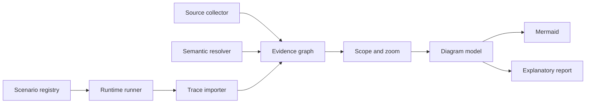
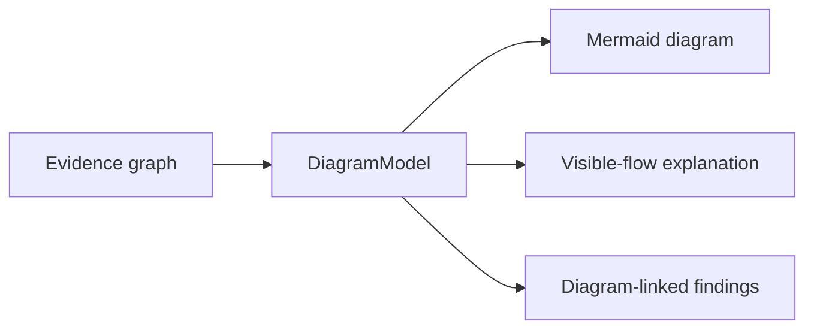
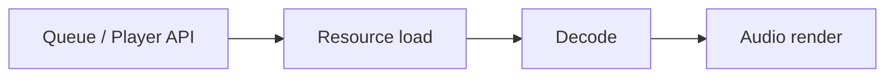

# 2026-07-28 Architecture Evidence Visualization

## Goal

Extend the reusable `kithara-devtools` architecture tooling so one existing
second-level command, `just arch viz`, automatically derives an architectural
model from Rust source, enriches it with optional deterministic runtime
evidence, renders navigable Mermaid diagrams, and explains those diagrams in an
adjacent Markdown report.

The source code remains the canonical architecture definition. Runtime
scenarios select observations; they do not describe architectural
relationships.

## Success Signal

- [ ] `just arch viz` performs the complete configured analysis without
  requiring follow-up commands.
- [ ] The static path works in a Rust workspace that does not use any Kithara
  crate, macro, fixture, or domain type.
- [ ] A consuming workspace can list deterministic tests or binaries as runtime
  scenarios in `.config/xtask.toml`.
- [ ] Static and runtime evidence merge into one graph whose edges retain their
  provenance and confidence.
- [ ] Mermaid is the primary human-facing result; the report is generated from
  the same visible diagram model and cannot invent a parallel architecture.
- [ ] The output can be navigated from workspace to crate, module, abstraction,
  and scenario views without rendering the entire function graph at once.
- [ ] Missing, empty, timed-out, truncated, or ambiguous evidence is visible and
  never reported as a clean complete analysis.
- [ ] Existing fast lint, pre-commit, and ordinary audit latency do not regress.

## Understanding Summary

- The tool exists to reveal call flow, data flow, task boundaries, and resource
  ownership rather than only file or module hierarchy.
- Its primary users are maintainers and coding agents reviewing architecture or
  preparing a refactor.
- Rust source is the only canonical model. There is no separately maintained
  file of nodes, edges, owners, or expected architecture.
- Static analysis is AST-first and uses semantic resolution for links that
  syntax alone cannot identify safely.
- Runtime analysis consists of canonical deterministic scenarios plus an
  optional manual trace overlay.
- Source annotations are an escape hatch. Existing tracing or probe macros are
  preferred; a new annotation is allowed only for a relationship that source
  and compiler semantics cannot recover.
- `kithara-devtools` is reusable. Kithara-specific tests, types, macros, and
  field names remain in the consuming workspace.

## Assumptions

### Performance

- The full command is a manual or rare CI operation, not a fast gate.
- A cached canonical run should target a five-minute local budget.
- Compatible scenarios are grouped by build configuration to avoid redundant
  workspace builds.
- Runtime events and diagram nodes have explicit budgets. Exceeding a budget
  produces aggregation plus a visible `TRUNCATED` marker.

### Scale

- The evidence graph may contain thousands of source items and many more
  runtime events.
- A rendered diagram is always a bounded projection, never an unfiltered dump
  of the evidence graph.
- Repeated runtime events are aggregated after their causal and resource
  identities have been preserved.

### Security And Privacy

- Analysis is local and offline.
- The command does not upload source, traces, diagrams, or reports.
- It does not auto-install tools or create user-level configuration.
- Trace conventions exclude credentials, URLs with sensitive query data, user
  payloads, and other secrets. Source paths are workspace-relative in outputs.

### Reliability

- Canonical scenarios are deterministic and network-independent.
- Manual traces are labelled separately and never become canonical evidence.
- A runtime trace proves only that a path was observed. Absence from a trace
  does not prove a path is dead.
- Independent thread ordering is not treated as happens-before. Cross-task or
  cross-thread causality requires an explicit span parent, task/resource
  identity, channel correlation, or another synchronizing observation.

### Maintenance And Ownership

- `kithara-devtools` owns configuration parsing, source collection, semantic
  backend contracts, scenario execution, the evidence graph, projections,
  Mermaid rendering, and diagram-derived analysis.
- A consuming workspace owns its scenario list and any runtime instrumentation
  adapter.
- Kithara continues to own `#[kithara::probe]` and its capture implementation in
  `kithara-test-macros` and `kithara-test-utils`.
- No Kithara-specific branch is permitted in the reusable engine.

## User Command

The single primary entrypoint remains:

```text
just arch viz
```

With no arguments it performs the complete configured analysis. Optional
arguments narrow or enrich the same pipeline:

```text
just arch viz --crate kithara-play
just arch viz --module resource
just arch viz --scenario queue-playback
just arch viz --trace path/to/runtime.jsonl
```

There is no separate `report` command. Existing hierarchy and `Arc` views become
projections of the shared model rather than separate analysis paths.

## Configuration Contract

Runtime scenarios use a generic core section in `.config/xtask.toml`.
Configuration selects executable observations; it never names expected graph
edges or owners.

Illustrative shape:

```toml
[[architecture.runtime.scenarios]]
name = "queue-playback"
command = "test"
package = "kithara-integration-tests"
test = "suite"
filter = "queue_playback_architecture"
features = ["probe"]
timeout_secs = 120
```

The final schema may normalize Cargo command variants, but it must preserve
these contracts:

- strict parsing with unknown fields rejected;
- stable scenario names;
- an explicit timeout;
- no shell interpolation;
- no implicit network or device dependency;
- a typed distinction between test, binary, and imported-trace scenarios;
- missing or renamed targets fail loudly.

Projects with no configured runtime scenarios receive a valid static-only
diagram.

## Architecture



### Source Collector

The collector uses Cargo metadata and a `syn` 3 AST to identify packages,
targets, modules, imports, re-exports, types, fields, traits, implementations,
functions, methods, macros, calls, constructors, spawns, channels, and common
resource containers.

`syn` provides syntax coverage, not semantic truth. The collector must never
claim that a syntactically similar path is a resolved call target.

### Semantic Resolver

Semantic resolution is a replaceable backend. The stable core contract accepts
symbol definitions, references, candidate call targets, trait implementations,
and resolution diagnostics.

The first implementation should resolve modules, imports, aliases, and direct
workspace paths without using unstable `rustc_private` APIs. A compiler or
rust-analyzer-backed resolver may enrich unresolved trait and generic calls
after its determinism, cost, and portability are measured.

An unavailable optional backend produces unresolved evidence, not guessed
edges. A backend required by the selected mode failing to start produces an
incomplete analysis and a non-zero exit.

### Runtime Runner And Trace Importer

The runner reads scenario definitions, groups compatible Cargo builds, injects
an isolated output path, applies a timeout, and captures stdout, stderr, exit
status, and trace metadata.

The importer consumes a neutral, versioned JSONL trace contract. Producers may
be:

- a generic tracing subscriber used by another Rust workspace;
- a Kithara adapter that exports existing `#[kithara::probe]` events;
- a supported profiler or runtime tool adapter;
- a previously captured manual trace.

The reusable engine recognizes neutral spans, events, source locations,
correlation identifiers, task/thread identifiers, and resource lifecycle
operations. It does not recognize `Queue`, `Player`, HLS, decoder, or other
project concepts.

### Evidence Graph

Every node and edge has a stable source identity and one or more evidence
records. Evidence classes are:

- `static`: directly represented in source syntax;
- `resolved`: linked by semantic resolution;
- `observed`: present in a runtime trace;
- `inferred`: conservatively derived from value or resource propagation;
- `unresolved`: known to exist but not safely attributable.

Useful edge kinds include calls, constructs, contains, implements, owns,
borrows, transfers, sends, spawns, waits-for, and drops. The schema must remain
extensible without requiring project-specific variants.

Multiple sources may strengthen one edge. Conflicting sources remain attached
as diagnostics; one source must not silently overwrite another.

## Diagram And Report Contract

The full evidence graph is not directly rendered. A scope and zoom request
produces a bounded `DiagramModel` containing:

- visible nodes and edges;
- aggregation groups;
- evidence styles;
- hidden-node counts;
- navigation links to deeper views;
- completeness and truncation markers.

Mermaid and the architecture report consume this exact model:



The report may explain visible flow, identify branching, high fan-in/fan-out,
long chains, unclear ownership, cycles, and possible simplifications. Every
finding references visible diagram node or edge identifiers.

If a concern requires hidden evidence, the report links to a deeper diagram
instead of describing an invisible architecture. Numeric data may explain a
collapsed group, for example that one visible factory represents fourteen
implementations.

The primary artifact is `architecture.md`, with each diagram immediately
followed by its explanation, findings, limitations, and navigation links.

## Output Layout

Outputs are revision-scoped and disposable:

```text
target/architecture/<revision>/
  architecture.md
  graph.json
  manifest.json
  diagrams/
    workspace.mmd
    crates/
    modules/
    scenarios/
  traces/
  logs/
```

`manifest.json` records tool version, source revision, selected scope,
configured scenarios, stage statuses, truncation, and whether manual evidence
was included.

## Error And Partial-Result Policy

- Invalid configuration or failure to build the static foundation is fatal.
- A canonical scenario failure or timeout returns non-zero but preserves
  partial artifacts marked `INCOMPLETE`.
- A successful scenario with no events is `EMPTY TRACE`, not clean.
- An unresolved static relation is a visible uncertainty, not a tool failure.
- An unmatched runtime event becomes an external or unresolved node rather
  than disappearing.
- Trace or node budgets produce aggregation and a visible `TRUNCATED` status.
- Recursive cycles and large strongly connected components are collapsible
  groups.
- Manual traces are visually distinct from canonical observations.
- A static-only project is supported and explicitly labelled.

## First Kithara Slice

Kithara is the first consumer, not part of the generic fixture. Its first
configured scenario follows:



The slice must expose:

- public entry and command flow;
- components or tasks created along the path;
- data and resource identities transferred between them;
- decoder construction and ownership;
- handoff into the audio render path;
- observed task/thread boundaries;
- unresolved or excessively branched regions.

The slice is successful when it produces a diagram that supports a concrete
architecture review without reading a file tree as a proxy for control flow.

## Testing Strategy

### Universal Fixture

A small fixture workspace independent of Kithara models:

- direct calls, re-exports, and aliases;
- trait dispatch with multiple implementations;
- `Arc` creation, clone, storage, and drop;
- channel sender and receiver;
- synchronous and async task creation;
- a resource identifier crossing task boundaries;
- an intentionally ambiguous dynamic call.

### Contract Tests

Tests assert graph contracts rather than snapshotting an entire large report:

- required nodes and edges exist;
- unsupported certainty is never upgraded to `resolved`;
- Mermaid and report consume the same `DiagramModel`;
- reports reference only visible identifiers;
- normalized topology is stable across repeated runs;
- empty, failed, timed-out, and truncated traces retain their status;
- static-only operation succeeds;
- a non-Kithara project needs no Kithara macro or dependency.

Kithara end-to-end coverage asserts the first slice's structural invariants.
It does not freeze incidental layout or runtime scheduling order.

Final acceptance uses `cargo xtask format` and `cargo xtask test`. Raw Cargo or
Nextest commands are scoped probes only and must state package, filter, lane,
and purpose when reported.

## Delivery Sequence

1. Introduce the generic evidence types, `DiagramModel`, and Mermaid renderer
  against the universal fixture.
2. Migrate existing hierarchy and `Arc` collection into the shared graph.
3. Add AST/name resolution with `syn` 3 and explicit uncertainty.
4. Add strict scenario configuration, the runner, and the neutral JSONL
  importer.
5. Configure the Kithara vertical scenario and adapt existing probe capture.
6. Add semantic enrichment for unresolved calls.
7. Add diagram-derived findings, manual trace overlays, and deeper navigation.

Each step must leave `just arch viz` useful and must not add a second graph,
renderer, or project-specific branch to the reusable engine.

## Affected Paths

- `crates/kithara-devtools/src/viz/`
- `crates/kithara-devtools/src/common/project.rs`
- `crates/kithara-devtools/Cargo.toml`
- `crates/kithara-devtools/README.md`
- `crates/kithara-devtools/CONTEXT.md`
- `.config/xtask.toml`
- `.config/just/arch.just`
- `crates/kithara-test-macros/`
- `crates/kithara-test-utils/`
- `tests/`
- `docs/guides/tooling.md`
- agent-facing command documentation that currently names architecture paths

The exact Kithara runtime test owner is selected during implementation
discovery; production player, stream, decode, or audio behavior is not changed
merely to make the visualization easier.

## Required Reads

- `AGENTS.md`
- `docs/workflows/rust-ai.md`
- `docs/guides/tooling.md`
- `docs/guides/test-harness.md`
- `crates/kithara-devtools/README.md`
- `crates/kithara-devtools/CONTEXT.md`
- `crates/kithara-test-macros/CONTEXT.md`
- `crates/kithara-test-utils/CONTEXT.md`

Read the owning `README.md` and `CONTEXT.md` for any Kithara runtime crate only
after the first scenario's exact path is selected.

## Validation Scope

- Unit and fixture tests for graph identity, merging, projection, rendering,
  configuration, trace import, and error statuses.
- Portable end-to-end run against the non-Kithara fixture workspace.
- Kithara end-to-end `just arch viz --scenario queue-playback`.
- `cargo xtask format`.
- `cargo xtask test`.

## Split Map

Do not split implementation until the evidence schema, `DiagramModel`, and
neutral trace contract are frozen by the integrator.

After that boundary is stable, independent ownership may be:

- generic graph, projections, and rendering;
- static and semantic collection;
- runtime scenario runner and trace import;
- Kithara scenario and probe export adapter.

Agents must not edit the same shared types or configuration schema in parallel.

## Sequencing Dependencies

- Evidence identity and provenance precede all collectors.
- `DiagramModel` precedes report findings.
- The neutral trace contract precedes Kithara's adapter.
- The universal fixture must pass before accepting Kithara-specific integration.
- Semantic enrichment follows a useful AST-only vertical result.

## Integrator

- Primary owner: freezes shared schemas, integrates each vertical step, runs
  final acceptance, and verifies that no project-specific dependency entered
  `kithara-devtools`.

## Risks And Non-Goals

### Known Risks

- `syn` 3 migration affects existing AST checks but does not provide name or
  type resolution by itself.
- Compiler and rust-analyzer APIs may be unstable, heavy, or unavailable in
  downstream environments.
- Instrumentation can perturb realtime paths or allocate unexpectedly.
- Concurrent event order can be mistaken for causality.
- Unbounded graphs become visually useless.
- Scenario lists can drift when tests are renamed.
- A report generator can overstate findings if it bypasses the diagram model.

### Mitigations

- Keep semantic resolution behind a measured backend contract.
- Keep runtime instrumentation feature-gated and allocation-conscious.
- Require correlation evidence for cross-thread edges.
- Budget and aggregate every rendered view.
- Strictly validate scenario targets and preserve stage statuses.
- Generate all narrative findings from `DiagramModel`.

### Non-Goals

- Replacing Samply, Instruments, Tokio Console, coverage, or other profilers.
- Turning the command into a fast lint or pre-commit gate.
- Inferring user-facing runtime correctness from one trace.
- Describing architecture in a maintained external graph configuration.
- Adding Kithara domain types to the generic engine.
- Rewriting production ownership merely to make instrumentation convenient.
- Guaranteeing exact dynamic-dispatch targets where compiler semantics and
  runtime evidence remain ambiguous.

## Decision Log

1. **First scope:** public Queue/Player flow through resource load, decode, and
  audio render. Broader workspace coverage follows a useful vertical slice.
2. **Canonical source:** Rust source code, not a maintained architecture
  configuration.
3. **Static method:** AST-first with semantic resolution for ambiguous links.
  Strict AST-only analysis was rejected as too incomplete.
4. **Runtime role:** deterministic scenarios provide canonical observations;
  optional manual traces are separate overlays.
5. **Annotation policy:** reuse existing tracing and probe macros first. Add a
  source annotation only for an otherwise irrecoverable dynamic relationship.
6. **Core architecture:** one evidence graph. Runtime-first and separate
  static/runtime report designs were rejected because they either depend on
  test completeness or create competing models.
7. **Reuse boundary:** `kithara-devtools` is domain-independent. Scenario
  selection belongs to the consuming workspace.
8. **Scenario registry:** use a small generic `.config/xtask.toml` section. It
  selects commands but contains no architectural edges.
9. **Primary output:** a bounded Mermaid diagram. The report explains and
  supplements the same `DiagramModel`.
10. **Command layout:** keep the existing second-level `just arch viz` entry.
  No separate top-level visualization or report command is added.
11. **Failure policy:** preserve partial artifacts, return non-zero for failed
  canonical stages, and mark incompleteness explicitly.
12. **Portability proof:** pass a non-Kithara fixture before accepting Kithara's
  runtime integration.

## Implementation Task Packet

<task_packet>
Goal:
Make `just arch viz` a complete, reusable source plus runtime architecture
analysis command whose primary output is a navigable Mermaid document.

Affected paths:
`Cargo.toml`, `Cargo.lock`, `crates/kithara-workspace-hack/Cargo.toml`,
`crates/kithara-devtools/`, `.config/xtask.toml`, `.config/just/arch.just`,
`tests/`, and command-routing documentation.

Read first:
`AGENTS.md`, `docs/workflows/rust-ai.md`, `docs/guides/tooling.md`,
`docs/guides/test-harness.md`, `crates/kithara-devtools/{README,CONTEXT}.md`,
`crates/kithara-test-{macros,utils}/CONTEXT.md`.

Same-as example:
Use `quality_lab` as the reference for strict configuration, stage manifests,
secret-stripped child processes, timeouts, preserved partial artifacts, and
typed statuses. Do not copy its external-tool policy or create another graph.

Constraints:
Keep `kithara-devtools` domain-independent; use one evidence graph and one
`DiagramModel`; keep `just arch viz` as the only primary user command; run
offline; do not auto-install tools; do not add architecture edges to config;
do not change production playback behavior for observability.

Non-goals:
No fast-gate promotion, no general profiler replacement, no global tracing
service, no `rustc_private` dependency, no full architecture annotation
language, and no broad player refactor in this task.

Expected output:
Revision-scoped `architecture.md`, Mermaid sources, graph and manifest JSON,
scenario traces and logs, plus deterministic diagram-derived findings.

Validation scope:
Portable fixture contracts, Kithara queue-playback scenario, scoped crate
tests after every commit, then `cargo xtask format` and `cargo xtask test`.

Split proposal:
Keep one integrator through the evidence schema, `DiagramModel`, CLI, and trace
schema commits. Split static semantics, runtime import, and the Kithara adapter
only after those public boundaries are frozen.
</task_packet>

## Implementation Decisions

### Refactoring Mode

Use a defensive migration:

1. introduce typed evidence and view structures;
2. translate current hierarchy and `Arc` findings into them;
3. switch the existing outputs to projections of the shared graph;
4. delete the old report-specific structures in the same commit that removes
  their last consumer.

No long-lived compatibility graph or duplicated collector is allowed.

### `syn` 3 Migration

Upgrade the workspace-owned `syn` dependency from 2 to 3 in one isolated
commit before adding the new collector. Fix the direct consumers:

- `crates/kithara-devtools`;
- `crates/kithara-test-macros`;
- `xtask`.

Regenerate `crates/kithara-workspace-hack/Cargo.toml` with
`cargo hakari generate`. Do not add a permanent `syn2`/`syn3` dual-major alias.
The known breaking shapes to audit include guarded match patterns, bare
function-pointer types, receiver representation, and function safety.

This migration improves syntax coverage but must not be presented as semantic
resolution.

### Semantic Backend

Use the stable Language Server Protocol boundary to an external
`rust-analyzer` process instead of linking unstable `ra_ap_*` internals or
using `rustc_private`.

The initial backend owns only:

- process initialization and shutdown;
- `textDocument/prepareCallHierarchy`;
- `callHierarchy/outgoingCalls`;
- optional incoming calls for impact views;
- mapping returned URIs and ranges to graph symbol IDs;
- diagnostics and time budgets.

The source collector invokes it only for items in the selected view or for
syntactically unresolved calls. It must not issue an exhaustive workspace-wide
request per function by default.

A fake stdio LSP server owns deterministic protocol tests. A real
`rust-analyzer` smoke test against the portable fixture is an environment
probe, not the only contract test. If the binary is unavailable, the command
preserves the AST diagram, marks semantic evidence unavailable, and returns
the configured incomplete status without guessing edges.

### Public Runtime Contract

The `viz` feature exposes a small versioned trace API for consuming workspaces:

- `TraceRecord`;
- a non-exhaustive record-kind enum;
- stable source, task/thread, span-parent, and correlation fields;
- a JSONL reader and writer;
- `TRACE_SCHEMA_VERSION`.

Public named-field structs and enums follow the workspace's non-exhaustive API
rule. The protocol represents neutral spans, events, and resource lifecycle
observations. Kithara probe types are converted by a test-side adapter.

## Planned Module Layout

Replace the monolithic `src/viz.rs` with domain-focused modules:

```text
crates/kithara-devtools/src/viz/
  mod.rs
  cli.rs
  run.rs
  graph.rs
  source.rs
  semantic.rs
  scenario.rs
  trace.rs
  view.rs
  mermaid.rs
  report.rs
  manifest.rs
```

`mod.rs` contains declarations and re-exports only. Split `semantic` or
`scenario` into submodules only if the implementation develops distinct
domains or approaches the repository's file-size limit.

Extract the already-proven child-process timeout and secret-environment logic
from `quality_lab::runner` into one internal shared process module only when
the scenario runner becomes its second consumer. Preserve the Quality Lab
tests while moving the owner.

## Executable Commit Plan

### Commit 1: Preserve The Approved Design

**Message:** `docs(architecture): design evidence-driven visualization`

**Owned paths**

- `docs/plans/2026-07-28-architecture-evidence-visualization.md`

**Acceptance**

- `mdfmt --check docs/plans/2026-07-28-architecture-evidence-visualization.md`
- `git diff --cached --check`

### Commit 2: Migrate The Workspace To `syn` 3

**Message:** `build(tooling): migrate ast consumers to syn 3`

**Owned paths**

- root `Cargo.toml` and `Cargo.lock`;
- `crates/kithara-devtools/src/`;
- `crates/kithara-test-macros/src/`;
- `xtask/src/`;
- generated `crates/kithara-workspace-hack/Cargo.toml`.

**RED**

- Change the workspace dependency and record compile failures from each direct
  consumer before adapting its syntax handling.

**GREEN**

- Update only shapes changed by `syn` 3.
- Keep every existing lint and macro test expectation unchanged unless the Rust
  syntax represented by the expectation itself changed.
- Regenerate Hakari output rather than editing its generated section manually.

**Scoped validation**

- `cargo check -p kithara-devtools -p kithara-test-macros -p xtask`
- owner tests for the changed AST checks and macros;
- `cargo hakari verify`.

### Commit 3: Introduce The Evidence Graph Without Changing Legacy Meaning

**Message:** `refactor(viz): unify architecture evidence and views`

**Owned paths**

- `crates/kithara-devtools/src/viz.rs` (deleted);
- new `crates/kithara-devtools/src/viz/{mod,cli,run,graph,source,view}.rs`;
- `crates/kithara-devtools/src/lib.rs`.

**RED**

- Add graph tests for stable symbol identity, merged evidence, conflicting
  certainty, and deterministic ordering.
- Add CLI tests proving that `viz` can be invoked without a required
  subcommand and remains one xtask command.

**GREEN**

- Pass `&Ctx` into `viz::run`; remove the second Cargo metadata lookup.
- Select packages from Cargo metadata rather than assuming `crates/*`.
- Translate current hierarchy and `Arc` sites into graph evidence.
- Preserve their useful projections as `--view hierarchy` and
  `--view ownership`; remove their independent output models.

**Scoped validation**

- `cargo test -p kithara-devtools viz`
- `cargo test -p xtask` for CLI shape.

### Commit 4: Produce The Portable Static Mermaid Document

**Message:** `feat(viz): render portable architecture diagrams`

**Owned paths**

- `crates/kithara-devtools/src/viz/{source,view,mermaid,manifest,run}.rs`;
- `crates/kithara-devtools/tests/fixtures/architecture-workspace/`;
- `crates/kithara-devtools/tests/viz_portable.rs`;
- `.config/just/arch.just`;
- `crates/kithara-devtools/{README,CONTEXT}.md`;
- all agent-facing docs found by a direct search for old architecture commands.

**RED**

- The fixture defines direct calls, imports, re-exports, trait candidates,
  `Arc`, channel, spawn, recursion, and an intentionally unresolved call.
- Tests require a bounded `DiagramModel`, stable Mermaid IDs, visible evidence
  styles, collapsed cycles, and workspace-relative links.
- A report contract test rejects findings that reference invisible IDs.

**GREEN**

- Make no-argument `just arch viz` generate
  `target/architecture/<revision>/architecture.md`.
- Add `--crate`, `--module`, and `--view` filters over the same model.
- Render a short limitations section before adding architecture findings.
- Remove old command paths from instructions in the same commit; do not keep
  undocumented aliases that agents could continue using.

**Scoped validation**

- portable fixture test;
- `just arch viz --crate kithara-devtools`;
- direct search proving old command forms no longer appear in instructions.

### Commit 5: Add Bounded `rust-analyzer` Semantic Evidence

**Message:** `feat(viz): resolve call edges through rust-analyzer`

**Owned paths**

- `crates/kithara-devtools/src/viz/semantic.rs`;
- semantic fields in `graph.rs` and `manifest.rs`;
- fake LSP fixture and protocol tests.

**RED**

- Cover initialization, request correlation, call-hierarchy mapping,
  cancellation/timeout, malformed responses, missing binary, and ambiguous
  targets.

**GREEN**

- Run one isolated `rust-analyzer` process per command.
- Resolve only selected or unresolved source items.
- Attach returned locations as `resolved` evidence.
- Preserve candidates and uncertainty instead of choosing one trait target.

**Scoped validation**

- fake-server protocol tests;
- optional real `rust-analyzer` fixture smoke;
- repeat the same fixture run and compare normalized graph topology.

### Commit 6: Add Generic Runtime Scenarios And Trace Import

**Message:** `feat(viz): merge configured runtime scenarios`

**Owned paths**

- `crates/kithara-devtools/src/common/project.rs`;
- `crates/kithara-devtools/src/viz/{scenario,trace,manifest,run}.rs`;
- shared internal child-process owner extracted from `quality_lab::runner`;
- portable runtime fixture.

**RED**

- Strict config tests: unknown keys, duplicate names, zero timeout, invalid
  package/target/filter combinations, and shell-like command strings.
- Trace tests: schema mismatch, empty, truncated, malformed, unmatched,
  cross-thread without correlation, and correlated resource transfer.
- Runner tests: secret environment removal, timeout, non-zero test exit,
  preserved stdout/stderr, and partial manifest.

**GREEN**

- Add `[architecture.runtime]` defaults and typed scenario variants.
- Validate selected Cargo package and target through metadata before spawning.
- Group compatible build configurations.
- Set an isolated trace path and import only the requested scenario's output.
- Keep static-only operation valid when no scenarios are configured.

**Scoped validation**

- config, trace, runner, and manifest unit tests;
- portable fixture static-only and runtime-enriched runs;
- existing Quality Lab runner tests after process-owner extraction.

### Commit 7: Add The Kithara Queue-Playback Scenario

**Message:** `test(architecture): trace queue playback ownership flow`

**Owned paths**

- `.config/xtask.toml`;
- `tests/Cargo.toml`;
- `tests/src/architecture_trace.rs`;
- `tests/src/lib.rs`;
- `tests/tests/kithara_queue/architecture_flow.rs`;
- `tests/tests/kithara_queue/mod.rs`;
- narrowly required existing probe sites or fields.

**RED**

- Add a deterministic local MP3/Symphonia scenario that fails until a neutral
  trace is written.
- Assert that loading completed, playback progressed, and offline render
  returned non-silent PCM before accepting the trace.

**GREEN**

- Reuse the existing local server, asset store, downloader, Queue/Player, and
  offline session helpers.
- Install the existing probe recorder, run
  `Queue::append -> load -> select -> decode -> render`, and convert captured
  events through the test-side neutral adapter.
- Add or enrich production probe fields only where static semantics and current
  events cannot correlate a required ownership transfer. Keep hot render
  instrumentation allocation-safe and feature-gated.
- Register exactly this scenario in `.config/xtask.toml`.

**Scoped validation**

- the scenario through the normal test harness;
- `just arch viz --scenario queue-playback`;
- inspect that the primary diagram contains the public entry, load, decode, and
  render regions with evidence styling and completeness status.

### Commit 8: Add Diagram-Derived Findings And Close Documentation

**Message:** `feat(viz): explain architecture diagrams`

**Owned paths**

- `crates/kithara-devtools/src/viz/report.rs`;
- renderer and view tests;
- `docs/guides/tooling.md`;
- `crates/kithara-devtools/{README,CONTEXT}.md`;
- the success checklist in this plan.

**RED**

- Findings for high fan-in/fan-out, long chains, unclear owner, large collapsed
  groups, and cycles must reference visible diagram IDs.
- A hidden-only issue must produce a deeper-view link, not prose about an
  invisible node.

**GREEN**

- Generate deterministic explanations and findings from `DiagramModel` only.
- Embed diagrams before their analysis in `architecture.md`.
- Document manual `--trace` overlays and incomplete-result interpretation.

**Final acceptance**

- `cargo xtask format`
- `cargo xtask test`
- `just arch viz`
- `just arch viz --scenario queue-playback`
- verify only intended plan/tooling/test files differ from the branch base.

## Implementation Stop Gates

Stop and reassess rather than widening scope when:

- `syn` 3 requires changing production behavior or test contracts rather than
  adapting AST shapes;
- the evidence schema needs a Kithara-specific enum variant;
- the semantic backend requires `rustc_private` or embedding unstable
  rust-analyzer libraries;
- runtime capture requires allocation or blocking on the realtime render
  thread;
- the report needs raw graph access to state a finding;
- a second mutable graph or architecture configuration appears;
- the canonical scenario depends on a public network, device, or nondeterminism.

## Per-Commit Handoff Contract

Every implementation commit reports:

<handoff_contract>
Done:
Remaining:
Touched paths:
Decisions made:
Validation:
Open risks:
</handoff_contract>

The integrator checks the top-level success signal after every vertical stage,
not only the nearest unit test.
